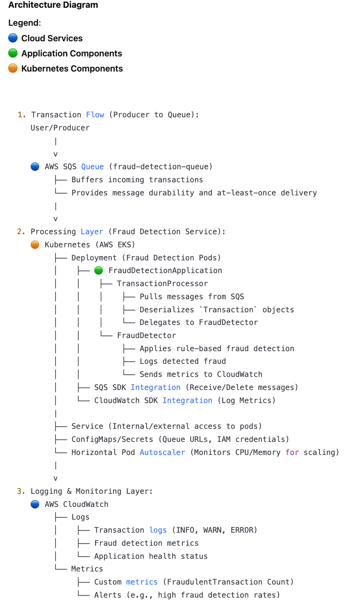
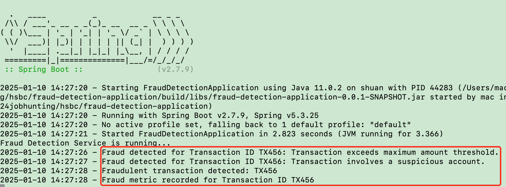
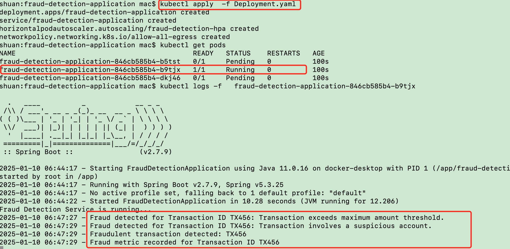
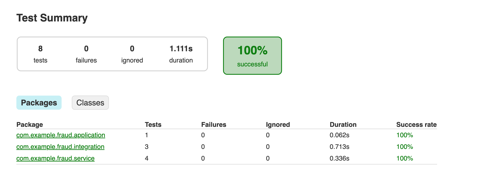
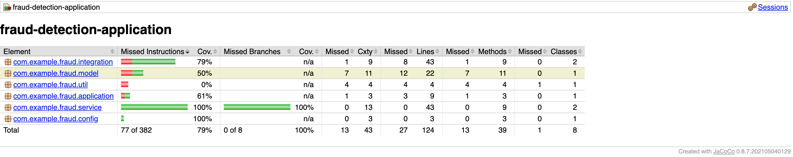

# Real-Time Fraud Detection System

  

## Objective

The Real-Time Fraud Detection System is designed to detect fraudulent financial transactions in real-time. This service is implemented in Java using Spring Boot, deployed on a Kubernetes (K8s) cluster on a cloud platform (AWS EKS, GCP GKE, or Alibaba ACK), and leverages AWS services such as SQS for message queuing and CloudWatch for metrics.

## Architecture Diagram





## Features

  

### 1. **Core Functionality**

-  **Transaction Analysis**: Analyzes financial transactions in real-time to detect potential fraud.

-  **Fraud Detection Mechanism**:

-  **Amount-Based Rule**: Flags transactions exceeding a predefined threshold (e.g., $10,000).

-  **Suspicious Account Rule**: Flags transactions involving suspicious accounts (e.g., predefined account IDs).

-  **Fraud Notification**: Logs fraudulent transactions and records metrics in AWS CloudWatch.

  

### 2. **High Availability and Resilience**

-  **Kubernetes Deployment**: Deployed on a Kubernetes cluster using AWS EKS, and local K8S.

-  **Message Queuing**: Uses AWS SQS for handling incoming transaction data.

-  **High Availability**: The service leverages Kubernetes' Horizontal Pod Autoscaler (HPA) for scalability.

 
    


## Design Choices

  

### 1. **Spring Boot Framework**

Spring Boot provides a robust, production-ready framework that simplifies Java application development. Its built-in dependency injection and scheduling capabilities allow for efficient processing of SQS messages and integration with cloud services like AWS SQS and CloudWatch.

  

### 2. **Rule-Based Fraud Detection**

A simple rule-based approach is used for fraud detection, ensuring ease of implementation and clarity in detecting anomalies. The system checks for transactions exceeding a defined threshold and monitors predefined suspicious accounts.

  

### 3. **AWS SQS for Message Queuing**

AWS SQS is chosen for its scalability, reliability, and ease of integration with cloud-native applications. It ensures the system can handle a high volume of real-time transactions without loss.

  
### 4. **AWS CloudWatch for Logging and Metrics**

AWS CloudWatch enables centralized logging and metrics collection, allowing for real-time monitoring and analysis of fraudulent transactions. It provides actionable insights for operational efficiency and debugging.

  

### 5. **Kubernetes Deployment**

Kubernetes ensures high availability, scalability, and resilience through features like Deployments, Services, and Horizontal Pod Autoscalers (HPA). The service is deployed in AWS EKS, and local K8S on docker desktop.

 
### 6. **Gradle Build Tool**

Gradle is used for its fast and flexible build process, enabling efficient dependency management and testing workflows.

  

## Prerequisites

- Kubernetes (AWS EKS, or local K8S)

- AWS SQS

- AWS CloudWatch

- Java (JDK 11 or higher)

- Gradle (8.1 or higher)

  

## Setup and Deployment

  

### 1. Clone the Repository

```bash

git clone  https://github.com/erdayegauss/fraud-detection-application.git

cd fraud-detection-application

```


### 2. AWS SQS Configuration

- [Create an SQS queue](https://docs.aws.amazon.com/AWSSimpleQueueService/latest/SQSDeveloperGuide/creating-sqs-standard-queues.html) (e.g., `fraud-detection-queue`). 

- run  ```bash  testScript ``` to trigger one transaction message,  as the following
 ```
 {
		"transactionId": "TX124",
		"amount": 15000.0,
		"senderAccount": "12345",
		"receiverAccount": "67890",
		"timestamp": 1736340587 
} 
```


  

### 3. CloudWatch Logging

- [Set up AWS CloudWatch to collect logs and metrics.](https://docs.aws.amazon.com/AmazonCloudWatch/latest/monitoring/GettingSetup.html)

- The system will log fraudulent transactions and record metrics related to fraud detection.

  

### 4. Build the Project

```bash

gradle build

```


### 5. Deployment
#### 5.1 Local Deployment
Start the local service
```bash

java -jar build/libs/fraud-detection-application-0.0.1-SNAPSHOT.jar

```
 Trigger one transaction message and get the output  
```
bash  testScript 
```


#### 5.2 Container Deployment
Start the service in docker container
```
bash  testContainer 
```
  
 Trigger one transaction message and get the output  
```
bash  testScript 
```


#### 5.2 Container Deployment
Start the service in docker container
```
bash  testContainer 
```
  
 Trigger one transaction message and get the output  
```
bash  testScript 
```


#### 5.3  Kubernetes Deployment

- Ensure you have a Kubernetes cluster running on AWS EKS, or local K8S.


#### 5.3  Kubernetes Deployment

- Ensure you have a Kubernetes cluster running on AWS EKS, or local K8S.

- Apply Kubernetes manifests to deploy the service:

```bash

	kubectl apply -f Deployment.yaml

```


Check the service log for one of the running pod
```bash

	kubectl logs -f 

```

 Trigger one transaction message and get the output  
```
	bash  testScript 
```


  

## Code Overview

  

### `FraudDetectionApplication.java`

The main entry point of the application, responsible for initializing and running the fraud detection service. It is configured to run on a scheduled task that processes messages from an AWS SQS queue.

  

### `FraudDetector.java`

This component contains the fraud detection logic, including predefined rules for detecting fraud:

- Transactions exceeding the `MAX_AMOUNT_THRESHOLD`.

- Transactions involving suspicious accounts.

  

It also records fraud metrics to AWS CloudWatch.

  

### `Transaction.java`

Represents a financial transaction with properties like `transactionId`, `amount`, `senderAccount`, `receiverAccount`, and `timestamp`.

  

### `TransactionProcessor.java`

Responsible for processing transactions from the SQS queue, deserializing them, and passing them to the `FraudDetector` for fraud detection. If a transaction is flagged as fraudulent, it logs the event and deletes the message from the queue.

  

## Testing

  

### 1. Unit and Integration Testing

Unit and Integration tests are written using JUnit. To run the tests, execute:

```bash

gradle test

```

  

### 2. Coverage Testing

Jacoco Coverage testing result generated along with ```gradle test```


  

### 3. Resilience Testing

Test the system's ability to recover from various failures, such as pod restarts and node failures, details in ResilienceTestReport.md

  

## Contributing

Feel free to fork this repository and submit pull requests. Please ensure any changes are well-documented and thoroughly tested before submitting.

  

## License

This project is licensed under the MIT License - see the [LICENSE](LICENSE) file for details.
