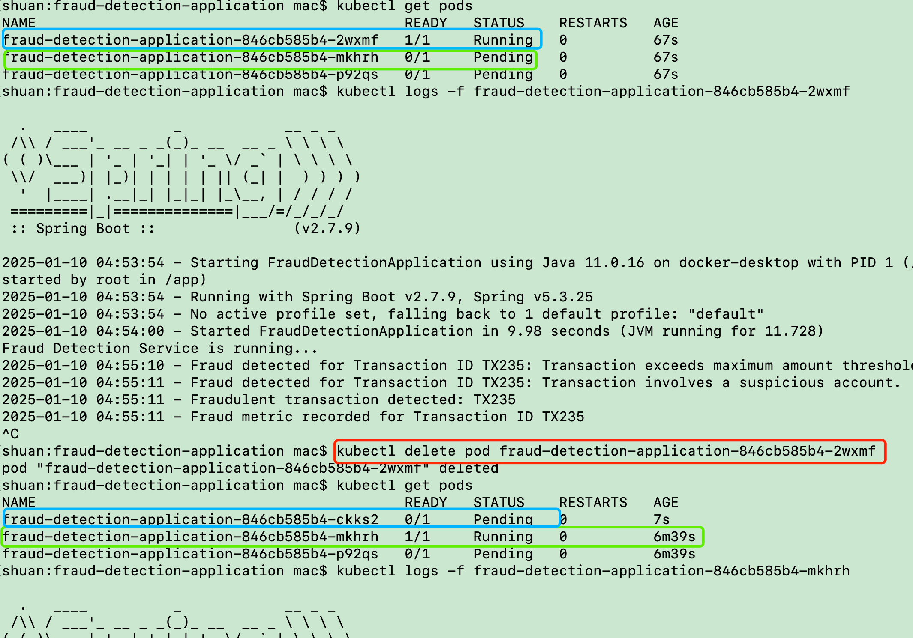

# Resilience Test Report: Kubernetes Pod Failover

## Experiment Overview

In this experiment, we test the resilience of a Kubernetes deployment with limited resources. The deployment consists of 3 pods running the same application. Initially, one pod is running successfully, while the other two remain in a `Pending` state due to insufficient resources. The experiment aims to evaluate the system's behavior when the running pod is terminated, and the pending pods are scheduled to run.

### Experiment Setup

- **Deployment**: 3 pods, each with the same application.
- **Pod States**:
  - **Pod 1**: Initially in the `Running` state.
  - **Pod 2 & Pod 3**: Initially in the `Pending` state due to insufficient resources.
  
- **Action**: The running pod (Pod 1) is manually terminated.
- **Expected Behavior**: 
  - Upon termination of Pod 1, one of the pending pods (Pod 2) should quickly transition into the `Running` state.
  - A new pod (Pod 3) should be created and remain in a `Pending` state, waiting for resources.

## Experiment Steps

1. **Deployment Initialization**:
   - A Kubernetes Deployment with 3 pods was created. 
   - Initially, Pod 1 transitioned into the `Running` state, while Pods 2 and 3 were in the `Pending` state due to resource constraints.

2. **Pod Termination**:
   - Pod 1 was manually terminated (simulating a failure or crash scenario).

3. **Pod Scheduling and Transition**:
   - After Pod 1 was terminated, Pod 2 quickly transitioned to the `Running` state.
   - A new Pod (Pod 4) was created but remained in the `Pending` state due to the unavailability of resources.

4. **Final State**:
   - The final state observed was:
     - **Pod 1**: Terminated.
     - **Pod 2**: Running.
     - **Pod 3**: Pending.
     - **Pod 4**: Pending (newly created).

## Observations

- The Kubernetes deployment was resilient to the failure of a pod. When Pod 1 was terminated, Kubernetes quickly scheduled Pod 2 to run.
- This highlights both the quick recovery capability of Kubernetes in terms of pod failover, and the resource management challenge that can arise in environments with limited capacity.

## Screenshot of Pod States

*Figure 1: Pod states before and after the termination of Pod 1.*

## Conclusion

The experiment demonstrated Kubernetes' resilience in handling pod failures by quickly recovering the application with a replacement pod. However, the experiment also highlighted the importance of resource management, as the system could not scale beyond the available resources. It's on personal laptop, very limited resources Future tests should focus on adjusting resource allocation and scaling policies to avoid resource starvation and ensure smooth failover and recovery.

## Recommendations

- **Resource Requests and Limits**: Ensure adequate resource allocation for pods to avoid being stuck in the `Pending` state.
- **Horizontal Pod Autoscaling**: Use Horizontal Pod Autoscalers (HPA) to dynamically scale the number of pods based on resource usage.
- **Node Scaling**: Consider adding more nodes to the cluster to handle increased resource demands during high traffic or failure recovery scenarios.

---

### Experiment conducted by: [Shuan Zhao]
### Date: [10th, Jan 2025]
